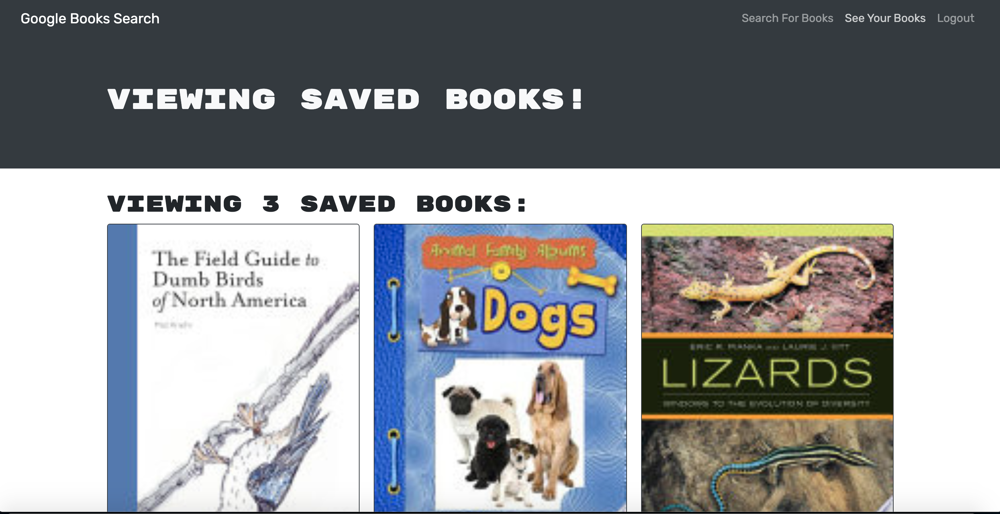

  # Book-Search
  

  ## Table of Contents

  * [License](#license)
  * [Questions](#questions)
  * [Deployed app](#deployed)

  ## Description
  This book search engine allows you to type in a keyword that will then produce a list of books with details such as title, description, authors. If you make an account, you can save books and create a list of your faves. 
  
  Using starter code, I converted the working RESTful API version of this app into a GraphQL API, making it more succinct and easier to scale.
   
  

  ## Deployed
  [Book-Search](https://booksearch979.herokuapp.com/)
 
  
  ## License
  Licensed under the MIT license

  ## Questions? 
  [my github](https://www.github.com/itsclairehi)

